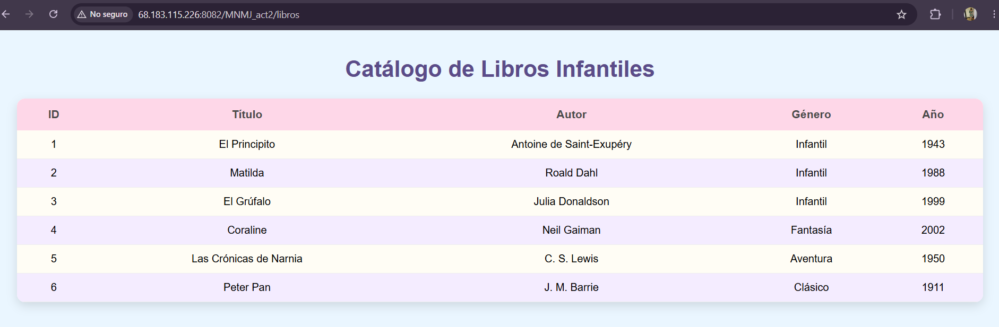
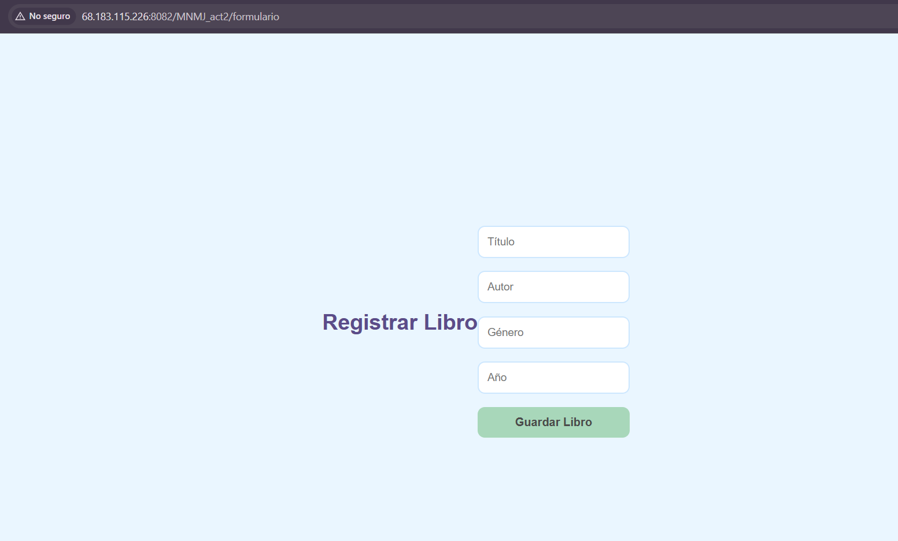
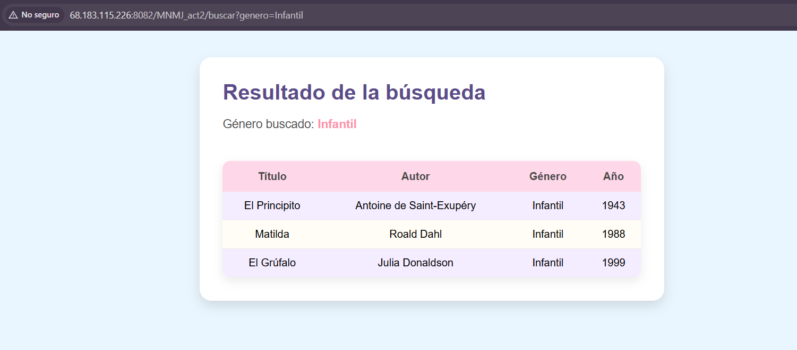
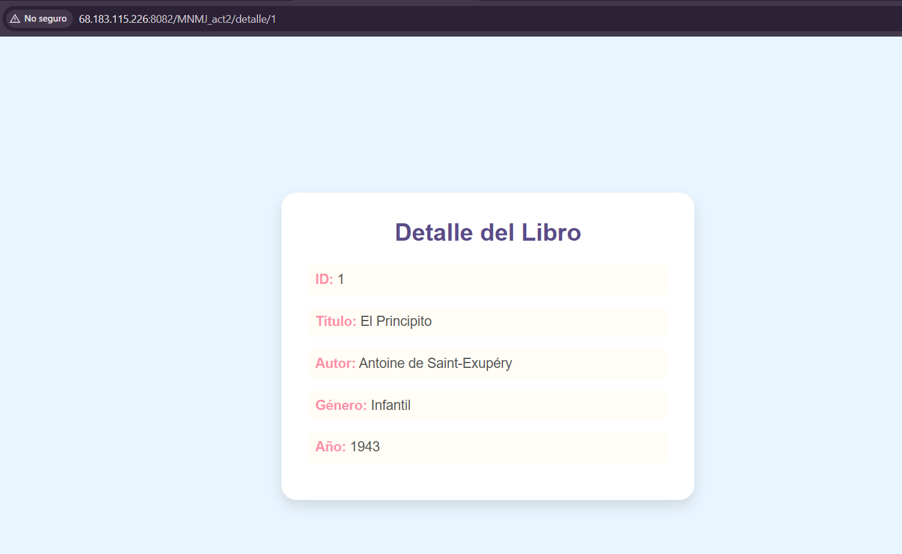
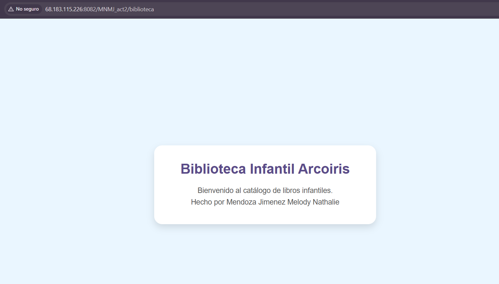
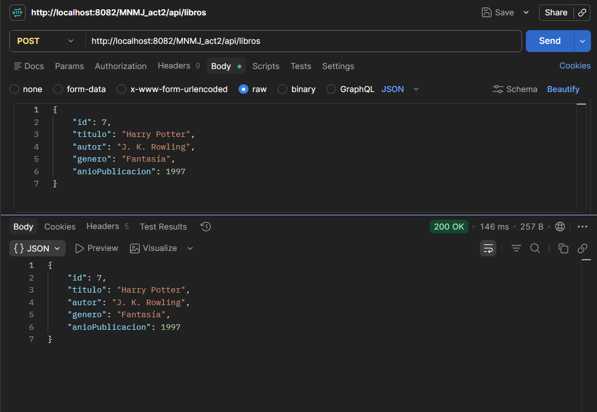

<div align="center">

# Act2. Spring MVC - Vistas con Thymeleaf, DTOs y Manejo de Peticiones

## Tecnológico Nacional de México
## Instituto Tecnológico de Oaxaca

### Programación Web

**Docente:** Mtra. Adelina Martínez Nieto

**Alumna:** Mendoza Jimenez Melody Nathalie

**No. de Control:** 23161034

</div>

---

# Descripción

Se desarrolló una aplicación web utilizando Spring Boot y Thymeleaf con el objetivo de poner en práctica el patrón MVC, la creación de vistas dinámicas y el manejo de diferentes tipos de peticiones.

La temática del proyecto es una **Biblioteca Infantil Arcoíris**, en la que es posible consultar un catálogo de libros, visualizar información detallada, realizar búsquedas por género, registrar nuevos libros y probar un servicio REST mediante una petición POST.

---

# Objetivos cumplidos

- Implementación de Spring MVC.
- Uso de vistas con Thymeleaf.
- Creación de un DTO para el manejo de información.
- Uso de `th:each` para mostrar datos dinámicamente.
- Implementación de `@ModelAttribute`.
- Implementación de `@RequestParam`.
- Implementación de `@PathVariable`.
- Uso de `@Value` para leer propiedades desde `application.properties`.
- Creación de un endpoint REST utilizando `@PostMapping`.
- Despliegue de la aplicación en un VPS.

---

# Tecnologías utilizadas

- Java 21
- Spring Boot
- Spring MVC
- Thymeleaf
- Maven
- HTML5
- CSS3
- Visual Studio Code
- Postman

---

# Funcionalidades

### Biblioteca

Muestra el nombre de la biblioteca obtenido desde el archivo `application.properties` utilizando `@Value`.

**URL**

<http://68.183.115.226:8082/MNMJ_act2/biblioteca>

---

### Catálogo de libros

Presenta el listado completo de libros utilizando `th:each`.

**URL**

<http://68.183.115.226:8082/MNMJ_act2/libros>

---

### Buscar libros por género

Permite filtrar los libros mediante el uso de `@RequestParam`.

**Ejemplo**

<http://68.183.115.226:8082/MNMJ_act2/buscar?genero=Infantil>

---

### Detalle de un libro

Consulta la información de un libro específico mediante `@PathVariable`.

**Ejemplo**

<http://68.183.115.226:8082/MNMJ_act2/detalle/1>

---

### Formulario de registro

Permite registrar un libro utilizando `@ModelAttribute`.

**URL**

<http://68.183.115.226:8082/MNMJ_act2/formulario>

---

# Evidencias

## Catálogo de libros (`th:each`)

<p align="center">
    
</p>

---

## Formulario (`@ModelAttribute`)

<p align="center">
    
</p>

---

## Resultado de `@RequestParam`

<p align="center">
    
</p>

---

## Resultado de `@PathVariable`

<p align="center">
    
</p>

---

## Vista obtenida con `@Value`

<p align="center">
    
</p>

---

## Petición POST en Postman

<p align="center">
    
</p>

---

# Estructura del proyecto

```text
src
├── main
│   ├── java
│   │   └── com.mjmn.act2.act2_t4
│   │       ├── controllers
│   │       ├── dto
│   │       └── Act2T4Application.java
│   │
│   └── resources
│       ├── static
│       ├── templates
│       └── application.properties
│
└── test
```

---

# Despliegue

La aplicación fue desplegada en un servidor VPS, ejecutándose en el puerto **8082**, permitiendo su acceso desde cualquier navegador mediante las rutas indicadas anteriormente.

---

# Autor

**Melody Nathalie Mendoza Jiménez**

Ingeniería en Sistemas Computacionales

